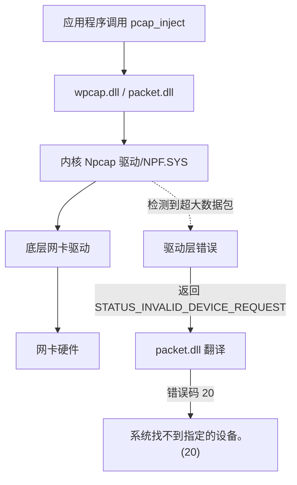

# 网卡发送数据包错误

---

### 问题描述

利用npcap库操作网卡向网络上进行数据包收发，

核心问题点：

1. 将待发送的缓冲区 `buffer` 大小调整到1024之后可正常发送数据包，调整到2048后显示无法找到网卡设备。
2. 并且与缓冲区待发送内容无关，只与缓冲区的大小有关

程序如下：

```c
/**
 * @author: luochenhao
 * @email: lch2022fox@163.com
 * @time: Sun 10 May 2026 18:42:15 CST
 * @brief: 利用npcap操作网卡发送和接收数据包
 */

#include <stdio.h>
#include <string.h>
#include <pcap/pcap.h>
#include <unique_tcp/platform/sys_plat.h>
#include "../common.h"

int main(void) {
  char ipaddr[2048] = {0};
  uint8_t macaddr[6] = {0};  // MAC地址固定为6字节
  strncpy(ipaddr, netcard8_phy_ip, sizeof(ipaddr) - 1);
  memcpy(macaddr, netcard8_hwaddr, sizeof(macaddr));
  // 打开网卡
  pcap_t* pcap = pcap_device_open(ipaddr, macaddr);
  if (!pcap) {
    plat_printf("pcap_device_open failed, ipaddr: %s\n", ipaddr);
    sys_pause();
    return 1;
  }
  plat_printf("pcap_device_open success, ipaddr: %s\n", ipaddr);
  // 发送数据包
  while (pcap) {
    static int counter = 0;
    plat_printf("send packet %d\n", counter++);
    // 填充数据1
    static uint8_t buffer[1024] = {0};
    memset(buffer, 0, sizeof(buffer));
    for (int i = 0; i < sizeof(buffer); i++) {
      buffer[i] = i;
    }
    // 填充数据2
    //static char buffer[1024] = {0};
    //memset(buffer, 0, sizeof(buffer));
    //for (int i = 0; i < sizeof(buffer); i++) {
    //  buffer[i] = 'c';
    //}
    // 发送数据包
    int ret = pcap_inject(pcap, buffer, sizeof(buffer));
    if (ret < 0) {
      plat_printf("pcap_inject failed\n");
      plat_printf("  return value: %d (bytes sent, negative means error)\n", ret);
      plat_printf("  buffer size: %d bytes\n", (int)sizeof(buffer));
      plat_printf("  error: %s\n", pcap_geterr(pcap));
      break;
    }
    sys_sleep(1000);
  }
  // 关闭网卡
  pcap_close(pcap);
  sys_pause();
  return 0;
}
```

报错如下：

```
pcap_device_open success, ipaddr: 192.168.159.1
send packet 0
pcap_inject failed
  return value: -1 (bytes sent, negative means error)
  buffer size: 2048 bytes
  error: send error: PacketSendPacket failed: 系统找不到指定的设备。  (20)
请按任意键继续. . .
```

### 问题原因

npcap发送缓冲区大小不同导致结果差异，

基本原因为待发送的数据包大小，超过了网络链路层的 `MTU` 最大传输单元上限导致。

MTU（Maximum Transmission Unit）是网络接口层所能传输的最大数据包大小（包含以太网头部、IP头部、TCP/UDP头部以及数据负载）。

通常情况下标准以太网MTU 大小为1500字节，

- **直接原因**：2048 字节 > 标准以太网 MTU (1500 字节)。
- **根本原因**：Npcap 底层驱动无法处理大于 MTU 的数据包，反馈了一个误导性的“设备找不到”错误。
- **解决方案**：要么将发送包限制在 1500 字节以内，要么在整个网络环境中启用巨帧（MTU ≥ 2048）

| 缓冲区大小 | 是否超过 MTU   | 结果               |
| :--------- | :------------- | :----------------- |
| 1024 字节  | 否（小于1500） | ✅ 成功             |
| 2048 字节  | 是（大于1500） | ❌ 失败，设备找不到 |

为什么系统报错为找不到指定设备？



1. Npcap 内核驱动检测到超大的数据包后，可能向底层网卡发送请求；
2. 如果网卡无法处理，会返回 `STATUS_INVALID_DEVICE_REQUEST` 之类通用错误；
3. `packet.dll` 将其翻译为错误码 20（`ERROR_PATH_NOT_FOUND`）抛给用户态程序。
4. 类似的场景（如发送超过 2000 字节数据包）也曾出现“PacketSendPacket failed: The request is not supported”或设备不可用等报错

### 验证方式

1. 验证当前网卡MTU：打开命令行提示符输入：

   ```
   netsh interface ipv4 show subinterfaces
   ```

   ```
   C:\Users\34538>netsh interface ipv4 show subinterfaces
   
          MTU  MediaSenseState      输入字节     输出字节  接口
   ----------  ---------------  ------------  ------------  -------------
   4294967295                1             0        147675  Loopback Pseudo-Interface 1
         1500                1    4152752093     802725592  WLAN
         1500                5             0             0  本地连接* 1
         1500                5             0             0  以太网
         1500                5             0             0  本地连接* 2
         1500                1        262072       1153834  VMware Network Adapter VMnet1
         1500                1        299295       1166940  VMware Network Adapter VMnet8
         
   C:\Users\34538>
   ```

2. 尝试启用巨帧（Jumbo Frame）

   如果 **整个网络环境**（网卡、交换机、对端设备）均支持巨帧，可将 MTU 提升至 9000：

   巨帧不是所有设备都能支持的，必须确保端到端的所有节点均启用相同 MTU。

   ```
   netsh interface ipv4 set subinterface "以太网" mtu=9000 store=persistent
   ```

   


